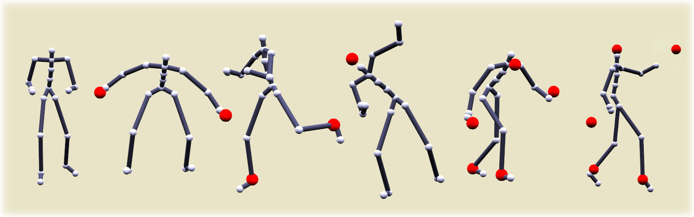

# Learning-based pose edition for efficient and interactive design

This repository contains the code necessary to reproduce the results presented in our paper "Learning-based pose edition for efficient and interactive design", presented at the CASA 2021 conference. 

A preprint of the paper can be found [here](https://hal.archives-ouvertes.fr/hal-03275581/), and supplementary video [here](https://youtu.be/h8nzECEtw3c ).

## Abstract

>Authoring an appealing animation for a virtual character is a challenging task. In computer-aided keyframe animation artists define the key poses of a character by manipulating its underlying skeletons. To look plausible, a character pose must respect many ill-defined constraints, and so the resulting realism greatly depends on the animator's skill and knowledge. Animation software provide tools to help in this matter, relying on various algorithms to automatically enforce some of these constraints. The increasing availability of motion capture data has raised interest in data-driven approaches to pose design, with the potential of shifting more of the task of assessing realism from the artist to the computer, and to provide easier access to nonexperts. In this article, we propose such a method, relying on neural networks to automatically learn the constraints from the data. We describe an efficient tool for pose design, allowing naïve users to intuitively manipulate a pose to create character animations. 


<p align="center">
 
 <p align="center"><i>Single and multiple-solvers skeleton manipulation</i></p>
</p>

## Set up
We provide a conda environment file. Set up your environment with:

```bash
git clone https://github.com/leonvictor/neural-pose-edition
cd neural-pose-edition
conda env create -f conda_env.yaml
conda activate npe
```

## Running a demo
You can run a demo using a set of pre-trained weights for a few solvers by running:

```bash
python -m npe.demo
```

## Training 
You can also train the networks yourself using the following scripts. Options such as joint targets or the trained weight's save path can be changed by modifying the `config.yaml` file.

We do not own the data used in the demo so we unfortunately cannot share it here. You can either download the data from their respective owners themselves ([Emilya](http://www.lrec-conf.org/proceedings/lrec2014/pdf/334_Paper.pdf), [CMU and Edinburg](http://theorangeduck.com/page/deep-learning-framework-character-motion-synthesis-and-editing)), or provide your own (The preprocessing script is also available.)

```bash
# Preprocess the database
python -m data_preparation.export
# Training the base auto-encoder
python -m npe.networks.ae.train
# Training the constraint model
python -m npe.networks.constraints.train
```
 
 ## Citation
>Léon Victor, Alexandre Meyer, Saïda Bouakaz. Learning-based pose edition for efficient and interactive design. Computer Animation and Virtual Worlds, Wiley, 2021, ⟨10.1002/cav.2013⟩.
